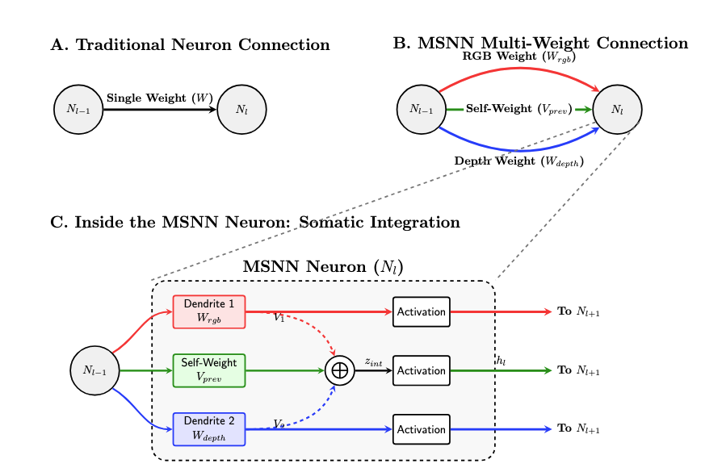
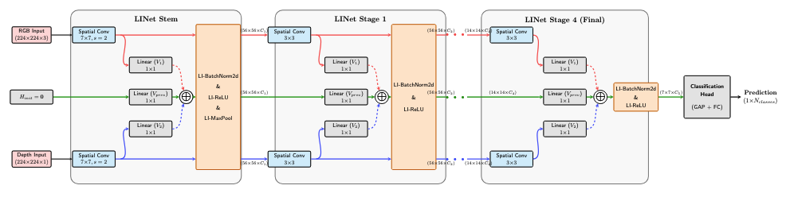

# LINet: Linear Integration Networks

A biologically-inspired multi-stream neural network architecture for continuous cross-modal learning, applied to RGB-D scene classification.

> **Multi-stream** describes the architecture (parallel per-modality pathways plus a learned integration pathway). **Multi-modal** describes the application (here, RGB and Depth as complementary input modalities). LINet is a multi-stream architecture applied to a multi-modal task; the two terms are not interchangeable.

This repository accompanies the paper **"MSNN-LINet: Cross-Modal Learning via Continuous Linear Integration"** (Clinger). See [`configs/reported_runs/`](configs/reported_runs/) for the exact hyperparameters used for every result in the paper.

## Overview

Most RGB-D fusion approaches are ad-hoc: **early fusion** concatenates inputs before any processing, **late fusion** merges predictions after independent networks have already committed to separate representations, and **intermediate hybrid** designs require architectural guesswork to place fusion blocks. None of these maintain dedicated parallel modality pathways while enabling continuous cross-modal learning at every layer.

In the primate visual system the soma integrates pre-threshold dendritic signals from multiple inputs *before* deciding whether to fire — integration precedes the nonlinear threshold rather than following it.



**LINet operationalizes this principle.** Each LIConv2d layer maintains three concurrent streams — **S₁ (RGB)**, **S₂ (Depth)**, and **Sᵢⁿᵗ (Integration)** — and combines the raw pre-activation outputs of the modality streams inside the integration stream *before* batch normalization and the ReLU. Cross-modal learning happens continuously at every convolutional layer, not at a single architectural fusion point.

## Architecture



LINet is built on a ResNet-18 backbone with each standard component replaced by its Linear-Integration counterpart: `Conv2d → LIConv2d`, `BatchNorm2d → LIBatchNorm2d`, `BasicBlock → LIBasicBlock`. The integration stream Sᵢⁿᵗ is dedicated and parallel — it is not an alias for "the output of fusion at the last layer" but a full-depth pathway whose final pooled features feed the classifier.

**Channel progression** (ResNet-18, width factor α = 0.75): [48, 48, 96, 192, 384] across the four stages, applied uniformly to every stream.

### LIConv2d operator

For a layer with `C_in` input and `C_out` output channels, each LIConv2d holds:

| Tensor | Shape | Role |
|---|---|---|
| `W₁` | `[C_out, C_in, 3, 3]` | Spatial filter for S₁ (RGB "dendrite") |
| `W₂` | `[C_out, C_in, 3, 3]` | Spatial filter for S₂ (Depth "dendrite") |
| `V₁` | `[C_out, C_out, 1, 1]` | 1×1 mixing weight, S₁ → integration |
| `V₂` | `[C_out, C_out, 1, 1]` | 1×1 mixing weight, S₂ → integration |
| `Vᵖʳᵉᵛ` | `[C_out, C_in, 1, 1]` | Projection of the prior integration state |

Forward computation per layer:

```
d₁     = W₁ ∗_s x₁                                  # modality-specific filtering, S₁
d₂     = W₂ ∗_s x₂                                  # modality-specific filtering, S₂
z_int  = V₁ * d₁ + V₂ * d₂ + Vᵖʳᵉᵛ ∗_s h_{l-1}     # pre-activation integration
h_l    = ReLU(BatchNorm(z_int))                     # integration stream output
y_i    = ReLU(BatchNorm(d_i))   for i ∈ {1, 2}      # per-stream outputs
```

Final classification uses only the global-average-pooled Sᵢⁿᵗ features. Stream outputs y_i carry forward to feed the next layer's d_{i,next}.

### Key design decisions

- **1/N constant init for V₁, V₂** — Kaiming initialization scrambles gradients through the stream-to-integration bridges, producing a failure mode that mimics overfitting. Filling V₁, V₂ entries with `1/num_streams` restores gradient coherence (§3.2 of the paper).
- **Orthogonal init for Vᵖʳᵉᵛ** (or Kaiming×0.1 at non-square transition layers) to preserve gradient norms on the integration self-pathway.
- **Progressive Modality Dropout** — Bernoulli blanking probability ramps linearly from 0 to p_max over T_ramp epochs, preventing pathway collapse (negative co-learning) by forcing each stream to carry an independent discriminative signal (§3.3).
- **Ablative stream monitoring** — Per-stream contribution C_i is measured by zeroing one stream at evaluation time. Diagnoses modality dominance vs. pathway collapse (§3.4).

## Results

Mean Class Accuracy (MCA, %) on the official SUN RGB-D 19-class test split.

| Method | Pretrained | RGB | Depth | Fusion |
|---|---|---:|---:|---:|
| ResNet-18 baseline | — | 36.0 | 37.4 | — |
| ResNet-18 early fusion baseline | — | — | — | 39.7 |
| ResNet-18 late fusion baseline | — | — | — | 41.7 |
| SS-CNN (Liao et al., 2015) | — | **36.1** | — | 41.3 |
| CoMAE (Yang et al., 2023, ViT-B, ~86M) | — | 27.5 | **38.6** | 40.5 |
| **LINet (no MD)** | — | 15.0 | 14.4 | 43.5 |
| **LINet + Progressive MD** | — | 33.7 | 35.7 | **45.2** |
| Wang et al. (2016) | Places | 40.4 | 36.5 | 48.1 |
| Du et al. (2019), Aug. | ImageNet | **50.6** | **47.9** | 56.7 |
| CBCL (Ayub & Wagner, 2020) | Places365 | 48.8 | 37.3 | **59.5** |
| **LINet (no MD)** | ScanNet (100K) | 36.5 | 37.2 | 48.0 |
| **LINet + Progressive MD** | ScanNet (100K) | 39.2 | 38.4 | 49.6 |

**Headline numbers**: 45.2% MCA from scratch (strongest from-scratch result in the table at ResNet-18 scale), and 49.6% MCA with in-domain ScanNet pretraining. The remaining gap to Places365/ImageNet-pretrained methods is attributable to corpus scale (100K-frame ScanNet subset vs. multi-million-image scene-classification corpora) rather than the fusion mechanism itself; see paper §4.3 and §5.

LINet also transfers to **NYU Depth V2** (secondary benchmark, 10 scene categories): 50.1% from-scratch (no MD) → 50.8% with Progressive MD, exceeding both early- (44.8%) and late-fusion (49.3%) ResNet-18 baselines on the same dataset.

## Quick Start

```bash
git clone https://github.com/clingergab/Multi-Stream-Neural-Networks.git
cd Multi-Stream-Neural-Networks
pip install -e .
```

Programmatic use (defaults to RGB + Depth — a 2-modality, 3-stream configuration):

```python
import torch
from src.models.linear_integration.li_net3 import li_resnet18

model = li_resnet18(
    num_classes=19,                  # SUN RGB-D scene categories
    stream_input_channels=[3, 1],    # RGB (3ch) + Depth (1ch); a third
                                     # integration stream is built internally
    width_multiplier=0.75,           # α from paper (channels: [48, 48, 96, 192, 384])
    dropout_p=0.28,
    device='cuda',
    use_amp=True,
)

rgb   = torch.randn(4, 3, 224, 224, device='cuda')
depth = torch.randn(4, 1, 224, 224, device='cuda')
logits = model([rgb, depth])         # (4, 19) class logits from Sᵢⁿᵗ
```

## Data setup

This repository ships code only. You will need to download and preprocess each dataset yourself — the raw corpora are large and the licenses require you to accept them with the original distributors. The preprocessing scripts/notebooks below convert each raw corpus into the on-disk layout the training code expects (256×256 tensors + label files; the dataloader applies the 224×224 crop at train time).

### SUN RGB-D (primary benchmark)

1. **Get the raw data.** From the [SUN RGB-D project page](https://rgbd.cs.princeton.edu/), download:
   - `SUNRGBD.zip` (the image/depth corpus)
   - `SUNRGBDtoolbox.zip` (contains the official split file `traintestSUNRGBD/allsplit.mat`)
2. **Place the extracted contents at the hardcoded paths the script expects:**
   ```
   data/sunrgbd/SUNRGBD/         # extracted from SUNRGBD.zip
   data/sunrgbd/SUNRGBDtoolbox/  # extracted from SUNRGBDtoolbox.zip
   ```
3. **Run preprocessing.** This filters to the standard 19-category subset (categories with >80 images, matching every comparison paper) and writes 256×256 tensors:
   ```bash
   # Recommended for reproducing the paper (official train/test, no val sub-split)
   python3 scripts/preprocess_sunrgbd_19.py --no-val-split
   # → writes data/sunrgbd_19_traintest/

   # Dry-run first to see the category distribution without writing files:
   python3 scripts/preprocess_sunrgbd_19.py --dry-run
   ```
   Use `--output-dir <path>` to redirect the output if you want it elsewhere. The resulting directory is what you pass as `--data-root` to `train.py`.

### NYU Depth V2 (secondary benchmark)

1. **Get the raw data.** `scripts/preprocess_nyu_depth_v2.py` will auto-download `nyu_depth_v2_labeled.mat` (~2.8 GB) into `./data/` the first time it runs if the file is missing. You can also pre-download it manually with:
   ```bash
   python3 scripts/download_nyu_depth_v2.py --save-dir ./data
   ```
2. **Run preprocessing:**
   ```bash
   python3 scripts/preprocess_nyu_depth_v2.py --no-val-split
   # → writes data/nyu_depth_v2_10_traintest/
   ```
   Pass `--mat-file <path>` if the .mat is somewhere other than `./data/nyu_depth_v2_labeled.mat`, or `--output-dir <path>` to redirect the output.

### ScanNet (pretraining only)

ScanNet is gated: you must first complete the [ScanNet Terms of Use form](http://www.scan-net.org/) and receive the official download script from the authors. Once you have access, the preprocessing pipeline is a Colab notebook rather than a CLI script, because the full corpus is hundreds of GB and the pipeline runs a strict download-extract-delete micro-loop per scene to stay within Colab disk limits.

1. Open [`notebooks/scannet_preprocess.ipynb`](notebooks/scannet_preprocess.ipynb) in a Colab **High-RAM** runtime (no GPU needed).
2. The notebook downloads `.sens` + `.txt` files scene-by-scene, extracts evenly-spaced frames, blur-filters them, center-crops to 256×256, saves paired `_rgb.pt` / `_depth.pt` tensors, computes normalization stats, and packages the result as a `.tar.gz` uploaded to your mounted Google Drive.
3. Output: ~100K-frame subset at 256×256, ready to be passed as `--data-root` to `train.py` against the `scannet_pretrain_*.yaml` configs.

Re-doing the ScanNet preprocessing locally is also possible — the notebook is just Python plus shell calls — but expect tens of hours of bandwidth and at least 200 GB of free disk during the download phase before the per-scene cleanup catches up.

## Reproducing paper results

Per-run hyperparameters from Appendix A/B of the paper live in [`configs/reported_runs/`](configs/reported_runs/) — one YAML per row of Tables 1/2 (the rows for which the architecture is LINet). The thin wrapper `train.py` reads a config and runs the same training stack the notebooks use.

First make sure the corresponding dataset is preprocessed (see [Data setup](#data-setup) above). Then:

```bash
# Reproduce the headline 45.2% MCA from-scratch run (Table 1, Table B1 col. 2)
python3 train.py --config configs/reported_runs/sunrgbd_linet_progressive_md_from_scratch.yaml \
                 --data-root data/sunrgbd_19_traintest

# Reproduce the headline 49.6% MCA ScanNet-pretrained run (Table 1, Table B3 col. 2)
#   Step 1: pretrain on the 100K-frame ScanNet subset
python3 train.py --config configs/reported_runs/scannet_pretrain_progressive_md.yaml \
                 --data-root <path-to-preprocessed-scannet>
#   Step 2: fine-tune on SUN RGB-D from the ScanNet checkpoint
python3 train.py --config configs/reported_runs/sunrgbd_linet_progressive_md_scannet_pretrained.yaml \
                 --data-root data/sunrgbd_19_traintest \
                 --pretrained checkpoints/<scannet-run>/best_model.pt
```

GPU is required (training was done on a single NVIDIA T4 for SUN RGB-D / NYU and an A100 for ScanNet pretraining and HPO). See [`configs/reported_runs/README.md`](configs/reported_runs/README.md) for the full mapping from YAMLs to paper tables and table rows.

The Google Colab notebooks under `notebooks/` (e.g. `colab_LINet3_SUN_training_full.ipynb`, `colab_LINet3_ScanNet_SUN_transfer.ipynb`) are the original training entry points and contain the same hyperparameters; the configs + `train.py` are a thin, file-driven wrapper around that pipeline.

## Datasets at a glance

- **SUN RGB-D** (Song et al., 2015) — primary benchmark. 10,335 aligned RGB-D image pairs across 19 scene categories. Official split: **4,845 train / 4,659 test**. Images are resized to 256×256 and randomly cropped to 224×224 during training. Depth is provided as raw single-channel metric values in millimeters (0 = missing). See paper §4.1 and §5 (limitations: per-class distribution shift in the official split).
- **NYU Depth V2** (Silberman et al., 2012) — secondary benchmark, 1,449 images / 10 scene categories.
- **ScanNet** (Dai et al., 2017) — used as a 100K-frame in-domain RGB-D pretraining corpus (not for scene-label evaluation). Chosen over synthetic alternatives so the depth-sensor noise modes (occlusions, missing values, depth shadows) match SUN RGB-D.

## Repository structure

```
Multi-Stream-Neural-Networks/
├── src/
│   ├── models/
│   │   ├── linear_integration/li_net3/   # LINet implementation (LIConv2d, blocks, heads)
│   │   ├── multi_channel/                # MCResNet baseline (early/late fusion)
│   │   ├── core/                         # Base ResNet
│   │   ├── abstracts/                    # BaseModel (compile/fit interface)
│   │   └── common/                       # Shared utilities
│   ├── data_utils/                       # SUN RGB-D, NYU Depth V2, ScanNet loaders
│   ├── training/
│   │   ├── schedulers.py                 # Cosine + variants
│   │   ├── optimizers.py                 # Stream-specific param groups, stem-LR multiplier
│   │   ├── gpu_augmentation.py           # GPU-side augmentation
│   │   ├── modality_dropout.py           # Progressive MD schedule
│   │   └── callbacks/                    # Gradient/weight/pathway monitoring
│   └── evaluation/                       # Ablative stream monitoring, robustness
├── configs/
│   └── reported_runs/                    # One YAML per paper run (Tables 1, 2, B1–B5)
├── train.py                              # Config-driven entry point
├── notebooks/                            # Original Colab training notebooks
├── scripts/                              # Preprocessing and analysis scripts
├── tests/                                # Test suite
└── docs/                                 # Design notes and research documents
```

## Future work

- **NLP extension** — applying continuous multi-stream integration to text classification with semantic, phonetic, and morphological representations ([proposal](docs/NLP_MultiStream_Proposal.md)).

## Research documents

- [MSNN Research Proposal](docs/MSNN_Research_Proposal.md) — Project goals and biological inspiration
- [Integration Mechanism Research](docs/Integration_Mechanism_Research.md) — Core research framework
- [LINet Design Plan](docs/LINet_Design_Plan.md) — Architecture design decisions
- [GPU Optimization Results](docs/gpu_optimization_results.md) — Performance profiling and optimization
- [NLP Multi-Stream Proposal](docs/NLP_MultiStream_Proposal.md) — Extension to natural language processing

## License

Code is released under the [MIT License](LICENSE). The accompanying paper is licensed CC BY 4.0; MIT for the code is compatible with that.
