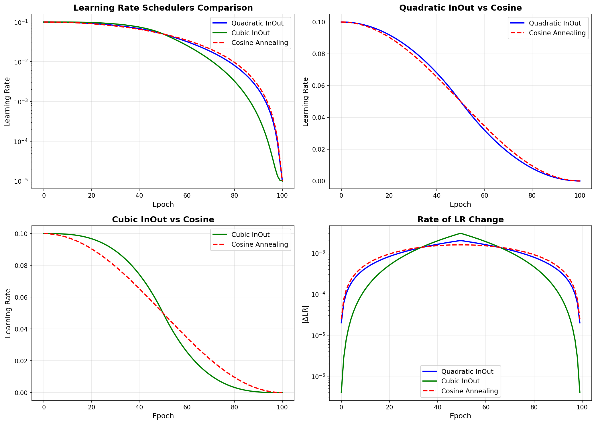

# Easing-Based Learning Rate Schedulers

## Overview

Two new learning rate schedulers based on Robert Penner's easing functions have been added to the training pipeline:

1. **QuadraticInOutLR** - Uses quadratic (t²) easing
2. **CubicInOutLR** - Uses cubic (t³) easing

These schedulers provide alternatives to `CosineAnnealingLR` with different acceleration/deceleration patterns.

## Mathematical Formulas

Both schedulers use an "InOut" pattern that accelerates in the first half and decelerates in the second half.

### QuadraticInOutLR

```python
t = current_epoch / T_max  # Normalized time in [0, 1]

if t < 0.5:
    # First half: ease in (accelerate)
    factor = 2 * t²
else:
    # Second half: ease out (decelerate)
    factor = -2 * (t - 1)² + 1

lr = eta_min + (base_lr - eta_min) * factor
```

### CubicInOutLR

```python
t = current_epoch / T_max  # Normalized time in [0, 1]

if t < 0.5:
    # First half: ease in (accelerate)
    factor = 4 * t³
else:
    # Second half: ease out (decelerate)
    factor = 4 * (t - 1)³ + 1

lr = eta_min + (base_lr - eta_min) * factor
```

## Usage

### Basic Usage

```python
from src.training.schedulers import QuadraticInOutLR, CubicInOutLR

# Quadratic easing
optimizer = torch.optim.Adam(model.parameters(), lr=0.1)
scheduler = QuadraticInOutLR(optimizer, T_max=100, eta_min=1e-5)

for epoch in range(100):
    train(...)
    scheduler.step()
```

```python
# Cubic easing
optimizer = torch.optim.Adam(model.parameters(), lr=0.1)
scheduler = CubicInOutLR(optimizer, T_max=100, eta_min=1e-5)

for epoch in range(100):
    train(...)
    scheduler.step()
```

### Using with setup_scheduler()

```python
from src.training.schedulers import setup_scheduler

# Quadratic
scheduler = setup_scheduler(
    optimizer=optimizer,
    scheduler_type='quadratic_inout',
    epochs=100,
    train_loader_len=len(train_loader),
    t_max=100,
    eta_min=1e-5
)

# Cubic
scheduler = setup_scheduler(
    optimizer=optimizer,
    scheduler_type='cubic_inout',
    epochs=100,
    train_loader_len=len(train_loader),
    t_max=100,
    eta_min=1e-5
)
```

### In Training Config

```python
# For LINet or MCResNet models
model.compile(
    optimizer='adamw',
    learning_rate=1e-4,
    scheduler='quadratic_inout',  # or 'cubic_inout'
    t_max=80,
    eta_min=1e-6
)
```

## Characteristics Comparison

### CosineAnnealingLR (Baseline)
- ✅ Smooth, symmetric cosine curve
- ✅ Moderate rate of change throughout
- ✅ Well-studied and widely used
- ✅ Good for most training scenarios

### QuadraticInOutLR
- ✅ Quadratic (t²) easing function
- ✅ Gentle start (slow acceleration)
- ✅ More aggressive in middle than cosine
- ✅ Gentle end (slow deceleration)
- 💡 **Best for**: When you want more aggressive LR decay in mid-training

### CubicInOutLR
- ✅ Cubic (t³) easing function
- ✅ Very gentle start (very slow acceleration)
- ✅ Much more aggressive in middle than cosine
- ✅ Very gentle end (very slow deceleration)
- 💡 **Best for**: When you want very smooth start/end with rapid middle transition

## Visual Comparison



The visualization shows:
- **Top-left**: All schedulers on log scale - shows overall decay pattern
- **Top-right**: Quadratic vs Cosine - quadratic starts slower, crosses cosine at midpoint
- **Bottom-left**: Cubic vs Cosine - cubic has most dramatic difference, very flat at start/end
- **Bottom-right**: Rate of change - cubic has spikes at start/end with gentle middle

## When to Use Each Scheduler

### Use CosineAnnealingLR when:
- ✅ Default choice for most scenarios
- ✅ Want proven, well-studied behavior
- ✅ Need balanced LR decay throughout training

### Use QuadraticInOutLR when:
- ✅ Early epochs need stable LR (less aggressive decay)
- ✅ Mid-training needs faster LR reduction
- ✅ Final epochs need gentle landing
- ✅ Training shows slow initial convergence

### Use CubicInOutLR when:
- ✅ Very early epochs need maximum stability
- ✅ Mid-training needs rapid LR decay
- ✅ Very late epochs need ultra-smooth convergence
- ✅ Training is sensitive to LR changes at start/end

## Parameters

Both schedulers accept the same parameters:

| Parameter | Type | Default | Description |
|-----------|------|---------|-------------|
| `optimizer` | `torch.optim.Optimizer` | Required | The optimizer to schedule |
| `T_max` | `int` | Required | Maximum number of epochs |
| `eta_min` | `float` | `0` | Minimum learning rate |
| `last_epoch` | `int` | `-1` | Index of last epoch (for resuming) |

## State Dict Support

Both schedulers support state dict save/load for checkpointing:

```python
# Save
state = scheduler.state_dict()
torch.save(state, 'scheduler_state.pt')

# Load
state = torch.load('scheduler_state.pt')
scheduler.load_state_dict(state)
```

## Multi-Parameter Group Support

Both schedulers work with optimizers that have multiple parameter groups (e.g., stream-specific learning rates):

```python
optimizer = torch.optim.Adam([
    {'params': model.stream1.parameters(), 'lr': 1e-4},
    {'params': model.stream2.parameters(), 'lr': 5e-4},
    {'params': model.fusion.parameters(), 'lr': 1e-3}
])

scheduler = CubicInOutLR(optimizer, T_max=100, eta_min=1e-6)
# Each parameter group will be scheduled independently
```

## Testing

Run the test suite to verify scheduler behavior and generate visualizations:

```bash
python3 tests/test_easing_schedulers.py
```

This will:
- ✅ Test basic scheduler behavior
- ✅ Verify state dict save/load
- ✅ Compare with CosineAnnealingLR
- ✅ Generate comparison visualization
- ✅ Print scheduler characteristics

## References

- Robert Penner's Easing Functions: https://robertpenner.com/easing/
- Original equations: https://robertpenner.com/scripts/easing_equations.txt
- Easing functions are widely used in animation and motion graphics
- First defined by Robert Penner in 2001 (BSD License)

## Implementation Notes

- Both schedulers follow PyTorch's scheduler pattern (similar to `CosineAnnealingLR`)
- No warm restarts (unlike `CosineAnnealingWarmRestarts`)
- Single cycle from `base_lr` to `eta_min` over `T_max` epochs
- Step once per epoch (not per batch)
- Compatible with all PyTorch optimizers
- Thread-safe and pickle-able
